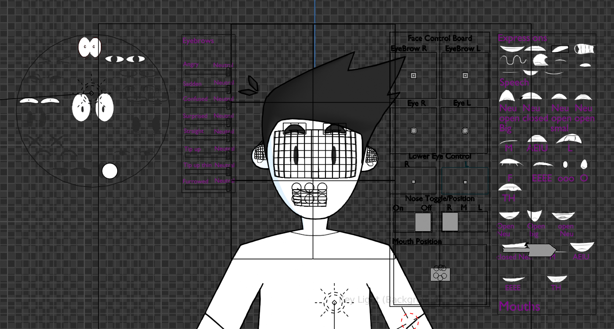

# Grease Pencil Face Rigs Addon
## Introduction

This is a Blender Addon that aims to allow seamless creation of 2D face rigs, complete with visibility and standard rig controls, using Blender's Grease Pencil tool. These face rigs can be then appended to 3D and 2D character rigs.

> [!NOTE]
> This addon is in the beginning stages of development, with only limited functionality currently implemented.

## Demo of Intended Funcitonality

## Installation
Download 'TestScript.py.' In Blender 3.0 or higher, go to edit > preferences. In the preferences menu, find the tab labelled "Add-ons" and then find and click the "install" button. navigate to the .py file and install the addon. Make sure to enable the addon by checking the greyed out name and then exit out of the preferences menu. The Grease Pencil tool will be located on a shelf in the 3D view currently labeled "GP face tool." 

